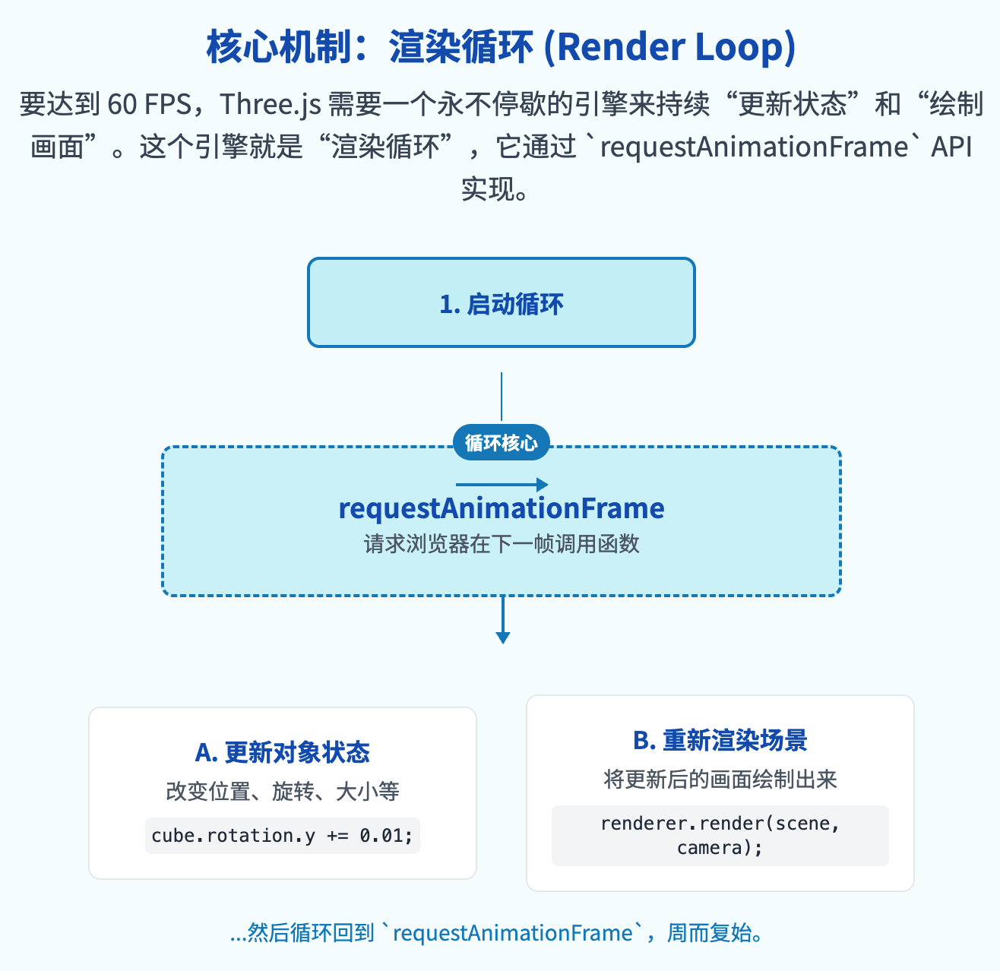

在 Three.js 中，动画是指在时间序列中连续改变三维场景中的对象属性（如位置、旋转、缩放），并持续重新渲染，从而在观察者眼中形成运动或变化的视觉效果。

它是将静态场景转化为动态、交互式体验的核心机制，是所有动态视觉效果的基础。要实现这一切，就需要建立一个能够持续更新并绘制画面的渲染循环。

# 核心概念讲解

在 Three.js 中，实现动画并非通过调用一个单一的“播放”函数，而是通过构建一个持续运行的“渲染循环”（Animation Loop）来达成。这个循环的核心是利用浏览器提供的 `window.requestAnimationFrame()` 方法。

### 定义与用途

`window.requestAnimationFrame()` 是一个标准的 Web API，它会通知浏览器希望执行一个动画，并请求浏览器在下一次重绘（Repaint）之前调用一个指定的回调函数来更新动画。

这个过程会以浏览器自身的刷新频率（通常是每秒 60 次）为节奏，从而产生流畅的动画效果。在 Three.js 的语境下，这个回调函数通常用于更新场景中物体状态和重新执行渲染操作。

### 构造与参数

渲染循环并非一个可实例化的 Three.js 对象，而是一种编程模式。其核心方法如下：

`window.requestAnimationFrame(callback)`

| 参数       | 类型     | 含义                                                                               |
| ---------- | -------- | ---------------------------------------------------------------------------------- |
| `callback` | Function | 一个在下一次浏览器重绘之前被调用的函数。这个函数就是每一帧动画需要执行的具体逻辑。 |

### 核心逻辑与步骤

在 `callback` 函数内部，通常需要执行两个关键步骤：

1. **更新对象状态**: 修改场景中一个或多个对象的属性。例如，改变其 `position`、`rotation` 或 `scale`。

   - `mesh.rotation.y += 0.01;`

2. **重新渲染场景**: 调用渲染器的 `render` 方法，将更新后的场景和相机状态绘制到画布上。

   - `renderer.render(scene, camera);`

为了让动画持续进行，`callback` 函数必须在执行的最后再次调用 `window.requestAnimationFrame()`，并将自身作为参数传入，形成递归调用。

```js
function animate() {
  // 请求浏览器在下一帧再次调用 animate 函数，形成循环
  requestAnimationFrame(animate);

  // 在每一帧中，更新物体的状态
  // 让立方体沿 X 轴和 Y 轴旋转
  cube.rotation.y += 0.01;

  // 执行渲染操作，将场景和相机信息渲染到屏幕上
  renderer.render(scene, camera);
}

// 首次调用动画函数，启动渲染循环
animate();
```



### 官方文档参考

`requestAnimationFrame` 是 Web API 的一部分，其最权威的参考来自于 MDN Web Docs：

- [MDN Web Docs: `window.requestAnimationFrame()`](<https://www.google.com/search?q=%5Bhttps://developer.mozilla.org/zh-CN/docs/Web/API/window/requestAnimationFrame%5D(https://developer.mozilla.org/zh-CN/docs/Web/API/window/requestAnimationFrame)> "null")

### 注意事项

- **必须递归调用**: 渲染循环函数必须在内部再次调用 `requestAnimationFrame`，否则动画将只执行一帧便停止。
- **渲染必不可少**: 每一帧都必须调用 `renderer.render(scene, camera)`，否则对物体属性的任何修改都不会在画面上体现出来。
- **性能与帧率**: `requestAnimationFrame` 的执行频率与显示器的刷新率挂钩。这意味着在不同刷新率的设备上，动画的快慢可能会不同。

# 代码示例

以下代码创建了一个基础的 Three.js 场景，并实现了一个简单的渲染循环，使一个立方体持续旋转。

<details>
  <summary style="color: #fff;background:#3992e6;padding: 4px;width: 120px;cursor:pointer;">点击展开代码</summary>

```html
<!DOCTYPE html>
<html lang="zh">
  <head>
    <meta charset="UTF-8" />
    <meta name="viewport" content="width=device-width, initial-scale=1.0" />
    <title>Three.js 动画示例</title>
    <style>
      body {
        margin: 0;
      }
      canvas {
        display: block;
      }
    </style>
  </head>
  <body>
    <script type="importmap">
      {
        "imports": {
          "three": "https://unpkg.com/three@0.160.0/build/three.module.js"
        }
      }
    </script>
    <script type="module">
      // 导入 Three.js
      import * as THREE from "three";

      // 1. 初始化场景 (Scene)
      const scene = new THREE.Scene();
      scene.background = new THREE.Color(0x111111); // 设置场景背景色

      // 2. 初始化相机 (Camera)
      const camera = new THREE.PerspectiveCamera(
        75,
        window.innerWidth / window.innerHeight,
        0.1,
        1000
      );
      camera.position.z = 5; // 将相机向后移动，以便观察物体

      // 3. 初始化渲染器 (Renderer)
      const renderer = new THREE.WebGLRenderer();
      renderer.setSize(window.innerWidth, window.innerHeight); // 设置渲染器尺寸为窗口大小
      document.body.appendChild(renderer.domElement); // 将渲染器的 canvas 元素添加到页面中

      // 4. 创建一个几何体 (Geometry) 和材质 (Material)
      const geometry = new THREE.BoxGeometry(1, 1, 1); // 创建一个 1x1x1 的立方体几何体
      const material = new THREE.MeshBasicMaterial({ color: 0x00ff00 }); // 创建一个绿色基础材质

      // 5. 创建一个网格模型 (Mesh)
      const cube = new THREE.Mesh(geometry, material); // 将几何体和材质结合成一个网格
      scene.add(cube); // 将立方体添加到场景中

      // 6. 定义动画函数 (Animation Loop)
      function animate() {
        // 请求浏览器在下一帧再次调用 animate 函数，形成循环
        requestAnimationFrame(animate);

        // 在每一帧中，更新物体的状态
        // 让立方体沿 X 轴和 Y 轴旋转
        cube.rotation.x += 0.01;
        cube.rotation.y += 0.01;

        // 执行渲染操作，将场景和相机信息渲染到屏幕上
        renderer.render(scene, camera);
      }

      // 7. 首次调用动画函数，启动渲染循环
      animate();

      // 监听窗口大小变化，以实现响应式画布
      window.addEventListener("resize", () => {
        // 更新相机宽高比
        camera.aspect = window.innerWidth / window.innerHeight;
        // 更新相机的投影矩阵
        camera.updateProjectionMatrix();
        // 更新渲染器尺寸
        renderer.setSize(window.innerWidth, window.innerHeight);
      });
    </script>
  </body>
</html>
```

</details>

<iframe src="step1/animation/demo.html" width="100%" height="500"></iframe>

### 实现逻辑说明

1. **场景设置**: 代码首先完成了 Three.js 的基本设置，包括场景、透视相机和 WebGL 渲染器，并将渲染器生成的 `<canvas>` 元素添加到 HTML 文档中。
2. **对象创建**: 创建了一个立方体网格 `cube` 并将其添加到场景中。这是动画的主体。
3. **动画函数定义**: `animate` 函数是渲染循环的核心。
4. **循环调用**: 函数内部第一行 `requestAnimationFrame(animate)` 是实现连续动画的关键。它确保 `animate` 函数在每一帧都被浏览器调用。
5. **状态更新**: `cube.rotation.x += 0.01` 和 `cube.rotation.y += 0.01` 在每一帧都微量增加立方体的旋转角度，从而产生旋转的动态效果。
6. **渲染执行**: `renderer.render(scene, camera)` 将包含了旋转后立方体的场景重新绘制出来。
7. **启动循环**: 在定义函数后，必须显式调用一次 `animate()` 来启动整个循环。
