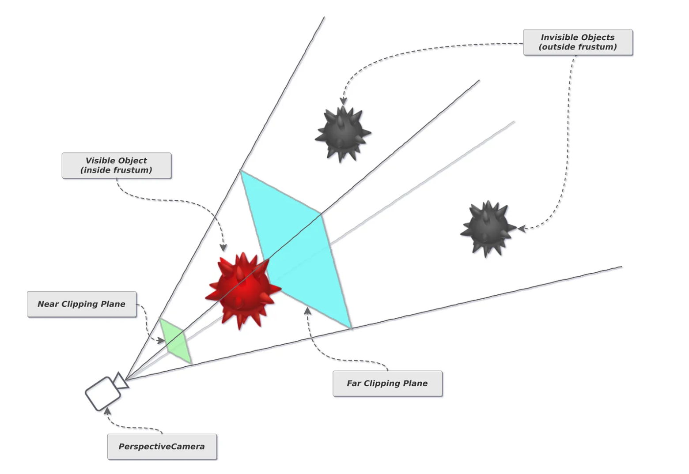
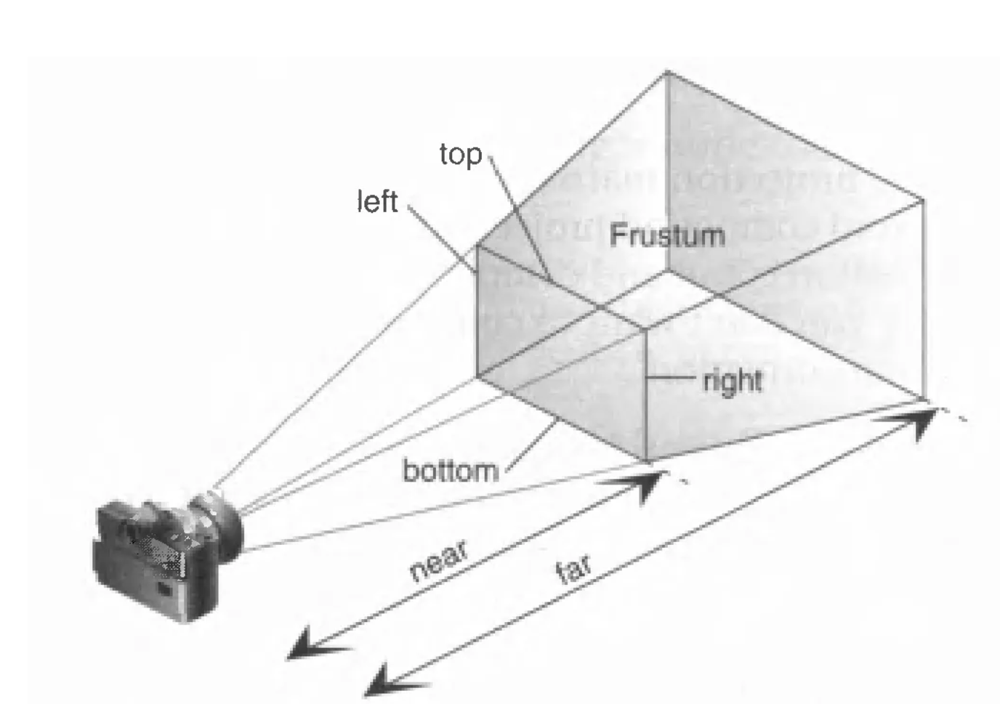

在三维空间中，相机（Camera）定义了场景的观察视角。它决定了哪些物体能够进入视野、以何种方式（例如透视或正交）被观察，并最终被渲染到二维的屏幕上。

相机是连接三维世界与最终二维图像的桥梁，是所有可见场景的基础。它的位置、朝向和内部参数共同构成了视景体（Frustum），只有位于这个视景体内部的物体才会被渲染。

大家先通过下面的案例，先体验下。

<iframe src="step1/camera/camera.html" width="100%" height="700" ></iframe>

## 透视相机

透视相机（`PerspectiveCamera`）模拟了人眼的视觉效果，其核心特征是“近大远小”。物体距离相机的远近会影响其在最终渲染图像中的尺寸大小。这种相机最常用于创建写实的三维场景，如三维游戏、建筑可视化和产品展示等。

#### 构造与参数

`PerspectiveCamera` 通过以下构造函数创建：

```javascript
new THREE.PerspectiveCamera(fov, aspect, near, far);
```

使用

```js
const camera = new THREE.PerspectiveCamera(
  fov, // Field of View
  aspect, // Aspect Ratio
  near, // Near Clipping Plane
  far // Far Clipping Plane
);

camera.position.set(x, y, z);
```

其参数定义了一个锥形的视景体（Frustum）。

| 参数     | 类型   | 含义                                                                                                           | 默认值 |
| -------- | ------ | -------------------------------------------------------------------------------------------------------------- | ------ |
| `fov`    | Number | 视场角 (Field of View)：从相机位置能够看到的视野范围，以度为单位。值越大，视野越广，但边缘的透视畸变也越明显。 | `50`   |
| `aspect` | Number | 宽高比 (Aspect Ratio)：渲染结果的宽度除以高度。通常应设置为渲染区域的宽高比，以避免图像拉伸。                  | `1`    |
| `near`   | Number | 近裁切面 (Near Clipping Plane)：相机能够渲染的最近距离。比此值更近的物体将不会被渲染。                         | `0.1`  |
| `far`    | Number | 远裁切面 (Far Clipping Plane)：相机能够渲染的最远距离。比此值更远的物体将不会被渲染。                          | `2000` |

#### 图解：视景体 (Frustum)



`PerspectiveCamera` 的视景体是一个四棱锥台（被切掉顶部的金字塔）。由 `fov`（视场角）、`aspect`（宽高比）、`near`（近裁切面）和 `far`（远裁切面）四个核心参数共同定义。只有处于这个锥体内部的物体才会被渲染。

这个图的红球在近裁切面和远裁切面之间所以它可见，灰球在远裁切面外部所以不可见。

#### 核心属性与方法

1. **.position**: `Vector3`

   - 功能：定义相机在三维空间中的位置。通过修改其 `.x`, `.y`, `.z` 属性可以移动相机。

2. **.lookAt(target: Vector3)**: `Method`

   - 功能：强制相机望向一个指定的三维坐标点。这是控制相机朝向最直接的方法。

3. **.updateProjectionMatrix()**: `Method`

   - 功能：当相机的构造参数（如 `fov`, `aspect` 等）在运行时发生改变时，必须调用此方法来更新相机的投影矩阵，否则更改不会生效。

#### 注意事项

- `near` 和 `far` 的值定义了场景的渲染深度范围，二者之差不宜过大或过小，否则可能导致深度冲突（Z-fighting）问题，表现为两个距离很近的平面出现闪烁。
- `aspect` 参数必须与渲染器（`renderer`）输出画布的宽高比保持一致，否则场景中的物体会被压扁或拉伸。通常在浏览器窗口大小改变时需要更新此值。

#### 官方文档参考

- [PerspectiveCamera - Three.js Documentation](https://threejs.org/docs/#api/zh/cameras/PerspectiveCamera "null")

### 代码案例

<details>
  <summary style="color: #fff;background:#3992e6;padding: 4px;width: 120px;cursor:pointer;">点击展开代码</summary>

```html
<!DOCTYPE html>
<html lang="zh">
  <head>
    <meta charset="UTF-8" />
    <meta name="viewport" content="width=device-width, initial-scale=1.0" />
    <title>Three.js 透视相机示例</title>
    <style>
      body {
        margin: 0;
      }
      canvas {
        display: block;
      }
      #info {
        position: absolute;
        top: 10px;
        width: 100%;
        text-align: center;
        color: #333;
        font-size: 18px;
        font-family: sans-serif;
      }
    </style>
  </head>
  <body>
    <div id="info">透视相机 (Perspective Camera) - 近大远小</div>

    <script type="importmap">
      {
        "imports": {
          "three": "https://cdn.jsdelivr.net/npm/three@0.160.0/build/three.module.js",
          "three/addons/": "https://cdn.jsdelivr.net/npm/three@0.160.0/examples/jsm/"
        }
      }
    </script>

    <script type="module">
      import * as THREE from "three";
      import { OrbitControls } from "three/addons/controls/OrbitControls.js";

      // 1. 基础设置
      const scene = new THREE.Scene();
      scene.background = new THREE.Color(0xf0f0f0);
      const renderer = new THREE.WebGLRenderer({ antialias: true });
      renderer.setSize(window.innerWidth, window.innerHeight);
      document.body.appendChild(renderer.domElement);

      // 2. 创建透视相机
      const aspect = window.innerWidth / window.innerHeight;
      const camera = new THREE.PerspectiveCamera(75, aspect, 0.1, 1000);
      camera.position.set(2, 3, 5); // 设置相机位置
      camera.lookAt(0, 0, 0); // 相机望向原点

      // 3. 添加物体以观察透视效果
      const geometry = new THREE.BoxGeometry(1, 1, 1);
      const materialNear = new THREE.MeshBasicMaterial({ color: 0xff0000 }); // 红色
      const materialFar = new THREE.MeshBasicMaterial({ color: 0x0000ff }); // 蓝色

      // 创建近处的立方体 (红色)
      const cubeNear = new THREE.Mesh(geometry, materialNear);
      cubeNear.position.set(0.75, 0.5, 0);
      scene.add(cubeNear);

      // 创建远处的立方体 (蓝色)
      const cubeFar = new THREE.Mesh(geometry, materialFar);
      cubeFar.position.set(-0.75, 0.5, -3);
      scene.add(cubeFar);

      // 添加一个地面网格辅助观察
      const gridHelper = new THREE.GridHelper(10, 10);
      scene.add(gridHelper);

      // 4. 添加轨道控制器以便交互
      const controls = new OrbitControls(camera, renderer.domElement);
      controls.enableDamping = true;

      // 5. 渲染循环
      function animate() {
        requestAnimationFrame(animate);
        controls.update(); // 更新控制器
        renderer.render(scene, camera);
      }

      // 6. 窗口自适应
      window.addEventListener("resize", () => {
        camera.aspect = window.innerWidth / window.innerHeight;
        camera.updateProjectionMatrix();
        renderer.setSize(window.innerWidth, window.innerHeight);
      });

      animate();
    </script>
  </body>
</html>
```

</details>

<iframe src="step1/camera/demo.html" width="100%" height="500"></iframe>

## 正交相机

#### 定义与用途

正交相机（`OrthographicCamera`）创建了一个没有透视效果的渲染视图。在正交投影中，所有物体无论远近，都以其原始尺寸进行渲染，不会产生“近大远小”的效果。这种相机非常适合用于工程制图（如 CAD）、二维风格的游戏（如模拟经营或 RPG 地图）或需要精确对齐的 UI 布局。

#### 构造与参数

`OrthographicCamera` 通过以下构造函数创建：

```
new THREE.OrthographicCamera(left, right, top, bottom, near, far)

```

其参数定义了一个长方体的视景体（Frustum）。

| 参数     | 类型   | 含义                                                          | 默认值 |
| -------- | ------ | ------------------------------------------------------------- | ------ |
| `left`   | Number | **左裁切面 (Left Clipping Plane)**：视景体左边界的 x 坐标。   | `-1`   |
| `right`  | Number | **右裁切面 (Right Clipping Plane)**：视景体右边界的 x 坐标。  | `1`    |
| `top`    | Number | **上裁切面 (Top Clipping Plane)**：视景体上边界的 y 坐标。    | `1`    |
| `bottom` | Number | **下裁切面 (Bottom Clipping Plane)**：视景体下边界的 y 坐标。 | `-1`   |
| `near`   | Number | **近裁切面 (Near Clipping Plane)**：相机能够渲染的最近距离。  | `0.1`  |
| `far`    | Number | **远裁切面 (Far Clipping Plane)**：相机能够渲染的最远距离。   | `2000` |

#### 图解：视景体 (Frustum)


`OrthographicCamera` 的视景体是一个长方体。由 `left`, `right`, `top`, `bottom`, `near`, `far` 六个参数定义。它没有透视效果，物体的大小不会随距离而改变。

#### 核心属性与方法

其核心属性和方法与 `PerspectiveCamera` 类似，同样包含 `.position`、`.lookAt()` 和 `.updateProjectionMatrix()`。

#### 注意事项

- 正交相机的视景体大小由 `left`, `right`, `top`, `bottom` 四个参数直接定义，与 `fov` 无关。
- 为了保持物体比例正确，通常需要根据渲染画布的宽高比来计算这四个参数。例如，可以设置 `left = -width / 2`, `right = width / 2`, `top = height / 2`, `bottom = -height / 2`。

#### 官方文档参考

- [OrthographicCamera - Three.js Documentation](https://threejs.org/docs/#api/zh/cameras/OrthographicCamera "null")

### 代码示例

<details>
  <summary style="color: #fff;background:#3992e6;padding: 4px;width: 120px;cursor:pointer;">点击展开代码</summary>

```html
<!DOCTYPE html>
<html lang="zh">
  <head>
    <meta charset="UTF-8" />
    <meta name="viewport" content="width=device-width, initial-scale=1.0" />
    <title>Three.js 正交相机示例</title>
    <style>
      body {
        margin: 0;
      }
      canvas {
        display: block;
      }
      #info {
        position: absolute;
        top: 10px;
        width: 100%;
        text-align: center;
        color: #333;
        font-size: 18px;
        font-family: sans-serif;
      }
    </style>
  </head>
  <body>
    <div id="info">正交相机 (Orthographic Camera) - 远近一样大</div>

    <script type="importmap">
      {
        "imports": {
          "three": "https://cdn.jsdelivr.net/npm/three@0.160.0/build/three.module.js",
          "three/addons/": "https://cdn.jsdelivr.net/npm/three@0.160.0/examples/jsm/"
        }
      }
    </script>

    <script type="module">
      import * as THREE from "three";
      import { OrbitControls } from "three/addons/controls/OrbitControls.js";

      // 1. 基础设置
      const scene = new THREE.Scene();
      scene.background = new THREE.Color(0xf0f0f0);
      const renderer = new THREE.WebGLRenderer({ antialias: true });
      renderer.setSize(window.innerWidth, window.innerHeight);
      document.body.appendChild(renderer.domElement);

      // 2. 创建正交相机
      const aspect = window.innerWidth / window.innerHeight;
      const frustumSize = 5; // 视景体高度
      const camera = new THREE.OrthographicCamera(
        (frustumSize * aspect) / -2, // left
        (frustumSize * aspect) / 2, // right
        frustumSize / 2, // top
        frustumSize / -2, // bottom
        0.1,
        1000
      );
      camera.position.set(2, 1, 5); // 设置相机位置
      camera.lookAt(0, 0, 0); // 相机望向原点

      // 3. 添加物体以观察正交效果
      const geometry = new THREE.BoxGeometry(1, 1, 1);
      const materialNear = new THREE.MeshBasicMaterial({ color: 0xff0000 }); // 红色
      const materialFar = new THREE.MeshBasicMaterial({ color: 0x0000ff }); // 蓝色

      // 创建近处的立方体 (红色)
      const cubeNear = new THREE.Mesh(geometry, materialNear);
      cubeNear.position.set(0.75, 0.5, 0);
      scene.add(cubeNear);

      // 创建远处的立方体 (蓝色)
      const cubeFar = new THREE.Mesh(geometry, materialFar);
      cubeFar.position.set(-0.75, 0.5, -3);
      scene.add(cubeFar);

      // 添加一个地面网格辅助观察
      const gridHelper = new THREE.GridHelper(10, 10);
      scene.add(gridHelper);

      // 4. 添加轨道控制器以便交互
      const controls = new OrbitControls(camera, renderer.domElement);
      controls.enableDamping = true;

      // 5. 渲染循环
      function animate() {
        requestAnimationFrame(animate);
        controls.update(); // 更新控制器
        renderer.render(scene, camera);
      }

      // 6. 窗口自适应
      window.addEventListener("resize", () => {
        const aspect = window.innerWidth / window.innerHeight;
        camera.left = (frustumSize * aspect) / -2;
        camera.right = (frustumSize * aspect) / 2;
        camera.updateProjectionMatrix();
        renderer.setSize(window.innerWidth, window.innerHeight);
      });

      animate();
    </script>
  </body>
</html>
```

</details>

<iframe src="step1/camera/demo1.html" width="100%" height="500"></iframe>
