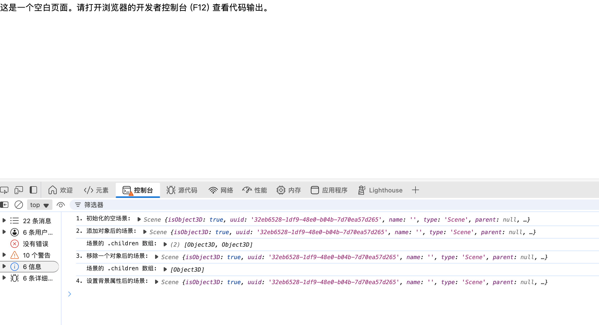

在 Three.js 中，`THREE.Scene` 是一个核心的容器对象，用于容纳和管理所有需要被渲染的 3D 对象、光源和辅助对象。

它在 Three.js 技术体系中扮演着舞台或世界的角色，定义了一个三维空间，所有可见元素都必须置于其中才能被最终绘制到屏幕上。可以将其理解为一个场景图 (Scene Graph) 的根节点，所有其他对象都以层级结构的形式添加到这个根节点之下。

### **核心概念讲解**

#### **定义与用途**

`THREE.Scene` 是 Three.js 应用程序中所有内容的顶级容器。它的主要用途是：

- **组织对象**: 管理场景中的所有 `Object3D` 派生对象，例如网格 (Mesh)、光源 (Light)、相机 (Camera) 以及辅助工具 (Helper)。
- **定义场景环境**: 可以通过其属性设置整个场景的背景（颜色或纹理）和雾效 (Fog)。
- **作为渲染源**: `WebGLRenderer` 在执行渲染操作时，会接收一个 `Scene` 对象和一个 `Camera` 对象作为输入，并遍历该场景中的所有可见对象，将其渲染出来。

任何希望被渲染的物体，都必须通过 `add()` 方法直接或间接地添加到 `Scene` 对象中。

#### **构造与参数**

`THREE.Scene` 对象的构造方法非常直接，它不接受任何参数。

**构造方法:**

```javaScript
const scene = new THREE.Scene();
```

**参数说明:**

`Scene()` 构造函数没有参数。它会创建一个新的、空的场景对象。

#### **核心属性与方法**

以下是 `THREE.Scene` 对象最常用且最重要的属性和方法。

| 属性/方法           | 类型 | 功能描述                                                                                                             |
| ------------------- | ---- | -------------------------------------------------------------------------------------------------------------------- |
| `.add( object )`    | 方法 | 将一个或多个对象（如 `Mesh`, `Light`, `Group`）添加为当前场景的子对象。这是构建场景内容最基本的操作。                |
| `.remove( object )` | 方法 | 从场景中移除一个子对象。被移除的对象及其所有后代将不再被渲染。                                                       |
| `.background`       | 属性 | 设置场景的背景。该属性的值可以是 `Color` 对象（纯色背景）、`Texture` 对象（纹理背景）或 `null`（透明背景，默认值）。 |
| `.children`         | 属性 | 一个数组，包含了所有直接添加到该场景中的子对象。通过遍历此数组，可以访问场景中的所有顶层对象。                       |

#### **官方文档参考**

关于 `THREE.Scene` 的更详尽的 API 信息，可以查阅 Three.js 官方文档：

- [Three.js Scene Documentation](https://threejs.org/docs/#api/en/scenes/Scene)

#### **要点**

- **场景本身不可见**: `Scene` 对象是一个逻辑上的容器，它本身没有几何形状或视觉表现，它仅仅是用来组织其他可见对象的数据结构。
- **场景图结构**: `Scene` 是场景图的根节点。通过 `add()` 方法添加的对象会成为其子节点，这些子对象本身也可以有自己的子节点，从而形成一个树状的层级结构。渲染器会递归遍历这个结构。
- **默认背景**: `Scene` 的 `.background` 属性默认为 `null`，这意味着渲染器的画布默认是透明的。如果 HTML 页面没有设置背景色，通常会看到黑色或白色，这取决于浏览器的默认样式。

### **代码示例**

以下代码片段创建了一个完整的 Three.js 应用，其中仅包含构建一个基础场景并添加一个立方体所需的最少元素。

```html
<!DOCTYPE html>
<html lang="zh">
  <head>
    <meta charset="UTF-8" />
    <title>Three.js Scene 纯数据操作示例</title>
  </head>
  <body>
    <p>这是一个空白页面。请打开浏览器的开发者控制台 (F12) 查看代码输出。</p>
    <script type="importmap">
      {
        "imports": {
          "three": "https://unpkg.com/three@0.165.0/build/three.module.js"
        }
      }
    </script>
    <script type="module">
      // 导入 Three.js 库
      import * as THREE from "three";

      // 1. 创建一个空的场景对象
      // scene 的本质是一个容器
      const scene = new THREE.Scene();
      console.log("1. 初始化的空场景:", scene);

      // 2. 创建一些内容用于添加到场景中
      // 这里仅用最基础的 Object3D 作为示例对象
      const object1 = new THREE.Object3D();
      const object2 = new THREE.Object3D();

      // 为便于在控制台观察，给对象命名
      object1.name = "对象A";
      object2.name = "对象B";

      // 3. 使用 .add() 方法将两个对象添加到场景中
      scene.add(object1, object2);
      console.log("2. 添加对象后的场景:", scene);
      console.log("   场景的 .children 数组:", scene.children);

      // 4. 使用 .remove() 方法将 '对象A' 移出场景
      scene.remove(object1);
      console.log("3. 移除一个对象后的场景:", scene);
      console.log("   场景的 .children 数组:", scene.children);

      // 5. 演示 .background 属性的设置
      // 即使没有渲染，scene 的属性依然可以被赋值和读取
      scene.background = new THREE.Color(0x0000ff); // 设置为蓝色
      console.log("4. 设置背景属性后的场景:", scene);
    </script>
  </body>
</html>
```



#### **实现逻辑说明**

此示例的所有操作结果都输出在浏览器的开发者控制台中，而非网页画面上。

1. **创建场景**: `new THREE.Scene()` 创建了一个场景实例。从控制台输出可以看到，它是一个对象，并且其 `children` 数组在初始时为空。
2. **创建并添加对象**: 创建了两个简单的 `Object3D` 实例。通过 `scene.add()`，将它们同时添加进场景。
3. **观察添加结果**: 打印 `scene.children` 属性。此时控制台会显示一个包含两个 `Object3D` 对象的数组，证明添加成功。
4. **移除对象**: 调用 `scene.remove(object1)` 将第一个对象从场景中移除。
5. **观察移除结果**: 再次打印 `scene.children` 数组，可以看到数组中只剩下了第二个对象，验证了移除操作的有效性。
6. **属性设置**: 最后，代码设置了 `.background` 属性。这表明 `Scene` 作为一个独立的对象，可以独立于渲染循环进行配置。

### **总结**

至此，一个基础的 Three.js 场景已经建立。`Scene` 对象作为根容器，承载了场景中的所有元素。通过 `.add()` 方法，可以将物体置入其中，并通过 `.background` 等属性来定义场景的环境。
